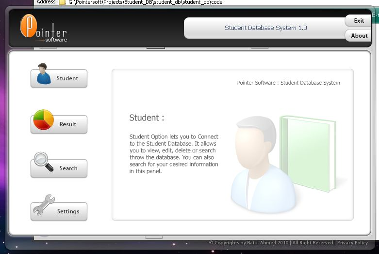

## Student Database System 1\.0

### Description

Student database is a multi-management database system. It manages all records of student and their result data too. Student database can generate a student’s result in cGPA depending on given subject marks automatically.

* Download ActiveX and register them by using RegThem.exe : Download : http://www.box.net/shared/893eyb6rsd
 
### More Info
 
Student database is a multi-management database system. It manages all records of student and their result data too. Student database can generate a student’s result in cGPA depending on given subject marks automatically.

These are the Functions of Student database:

•	Add, Edit and Remove Student information

•	Search student information by given id

•	Give you opportunity to upload and crop any size of student image for profile.

•	Automatically detects Pass and Fail marks depending on given credit.

•	Highlight Fail results

•	Generate cGPA of a student automatically when all marks are given

•	User friendly user inter face

•	Usage Less memory and Processor

•	Etc

             |
---                |---
**Submitted On**   |2010-05-01 22:20:46
**By**             |[Ratul Ahmed](https://github.com/Planet-Source-Code/PSCIndex/blob/master/ByAuthor/ratul-ahmed.md)
**Level**          |Advanced
**User Rating**    |4.5 (27 globes from 6 users)
**Compatibility**  |VB 6\.0
**Category**       |[Databases/ Data Access/ DAO/ ADO](https://github.com/Planet-Source-Code/PSCIndex/blob/master/ByCategory/databases-data-access-dao-ado__1-6.md)
**World**          |[Visual Basic](https://github.com/Planet-Source-Code/PSCIndex/blob/master/ByWorld/visual-basic.md)
**Archive File**   |[Student\_Da218006512010\.zip](https://github.com/Planet-Source-Code/ratul-ahmed-student-database-system-1-0__1-73106/archive/master.zip)

